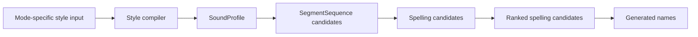

# Name Forge Architecture

Name Forge is a random-name workbench whose first serious mode is **Fiction cast**. The current implementation should be read as a fiction-cast product surface built on reusable generation, scoring, comparison, diagnostics, and export primitives.

The architecture goal is not to build a generic abstraction before the product earns it. The goal is to keep fiction-specific UX behind a clear mode boundary while the engine remains useful for future naming modes.

Related docs:

- [`product-brief.md`](product-brief.md): product thesis, mode strategy, candidate modes, and recommended sequencing.
- [`current-product-scope.md`](current-product-scope.md): active scope lens, shipped baseline, and next feature requirements.
- [`product-requirements.md`](product-requirements.md): original requirements and historical build-order scaffold.
- [`product-architecture.md`](product-architecture.md): product-level mode strategy.
- [`phase-one-closeout.md`](phase-one-closeout.md): Phase One completion and replacement tracking model.

## Current architecture thesis

Name Forge works by combining controlled randomness with explicit product judgment:

1. Compile ergonomic style input into `SoundProfile`, the internal phonotactic/prosodic profile contract.
2. Generate candidate names from seeded randomness and soft-coded style data while the sound-first core is introduced in slices.
3. Shape candidates through silhouettes, rarity planning, role metadata, and optional role influence.
4. Score candidates with decomposed fit signals, including role fit where applicable.
5. Select an ensemble that avoids obvious sameness.
6. Attach deterministic readability diagnostics without claiming canonical pronunciation.
7. Preserve explicit source descriptors where source or pack identity is useful, without treating source metadata as a cross-cutting runtime field.

The important split is:

- **Engine primitives** are shared and reusable.
- **Mode presentation** is user-facing and can be fiction-specific.

## Architectural principles

1. **Controlled stochasticity**: random generation is deterministic by seed and constrained by explicit settings.
2. **Sound structure before spelling**: style compilers produce a `SoundProfile`; generator slices produce a pre-spelling segment sequence before projecting viable spellings.
3. **Silhouette before spelling**: shape the intended name before exact letters are chosen.
4. **Ensemble-aware selection**: the first serious output is a cast, so repeated initials, endings, cadence, readability friction, and rarity clusters matter.
5. **Mode-aware UX, shared primitives**: Fiction cast can have role mix, slot overrides, cast health, and cast export without making those concepts global product assumptions.
6. **Hard-code mechanisms, not linguistic knowledge**: code owns schemas, algorithms, scoring, normalization, diagnostics, and source descriptor contracts; packs/providers own language-feel data.
7. **Generated primary names**: style packs guide generation; they are not copied as the primary output path.
8. **Sound-bearing output**: everything verbal that appears in the resultant name should be licensed by the compiled sound grammar. Prefixes, suffixes, honorifics, titles, epithets, and place-like components are not arbitrary downstream text decorations.
9. **Serializable IR contracts**: `SoundProfile` and downstream candidate types should stay data-shaped and should not store callbacks, caches, UI state, or runtime handles.
10. **Small abstraction first**: introduce seams only as needed. The current mode boundary is a lightweight config, not a full plugin framework.
11. **Pronounceability before pronunciation**: scoring and deterministic readability diagnostics may ship before text pronunciation, IPA, or audio artifacts.

## Runtime pipeline

The sound-first core is being introduced in scoped slices. The implemented sound-first internal boundary is:

```text
StyleInput
  -> compileStyle(input)
  -> SoundProfile
  -> generateSound(profile, rng)
  -> SoundCandidate
  -> SegmentSequence
  -> generateSpellings(sound)
  -> SpellingCandidate[]
  -> rankSpellings(spellings, profile)
  -> RankedSpellingCandidate[]
```

The current product runtime is not yet fully piped through this boundary. Until the wiring slice lands, the app has two paths:

```text
Current app runtime
  -> GenerationSettings
  -> NameSilhouette
  -> legacy candidate materialization
  -> variants
  -> identity composition
  -> UI/export
```

```text
New sound-first core
  -> StyleInput
  -> SoundProfile
  -> SoundCandidate
  -> SpellingCandidate[]
  -> RankedSpellingCandidate[]
```

Issue #91 should rectify this by making the sound-first path the runtime path rather than leaving two competing generation flows.

Future slices extend the sound-first boundary to:

```text
StyleInput
  -> compileStyle(input)
  -> SoundProfile
  -> SegmentSequence candidate pool
  -> SpellingCandidate pool
  -> RankedSpellingCandidate pool
  -> GeneratedName selection
```



The sequence layer is deliberately not called a single generated sound. `SegmentSequence` represents one pre-spelling candidate form with syllable segmentation metadata, then later projects to one or more spellings.

The current app runtime still uses the established Fiction cast pipeline until the sound-first wiring slice is implemented:

```text
Active mode config
  -> Default GenerationSettings
  -> User settings
  -> Resolve style pack
  -> Resolve role, role influence, and rarity settings
  -> Construct silhouettes
  -> Generate candidate pool
  -> Score candidates, including role signals
  -> Apply ensemble constraints
  -> Attach identity and role metadata
  -> Generate variants
  -> Diagnose readability
  -> Return ranked ensemble
```

Each step should remain testable as TypeScript. UI code renders controls and results; it should not own generation behavior.

## Style compiler contract

`StyleInput` captures ergonomic user intent for one naming job. It should describe how the name should feel to the user, not phonological implementation details or a generic mode selector. The first compiler input contains only broad style controls: feel, length, and distinctiveness.

`compileStyle(input)` is the boundary that translates those user-facing controls into the internal `SoundProfile`. That means phonotactic weights, cadence preferences, syllable targets, and similar sequence-generation details belong in the compiled profile, not in the user input.

`SoundProfile` is the single internal compiled engine contract for later segment-sequence generation work. The name is kept as the product contract for issue #87, but the type should be understood as a profile of phonotactic and prosodic preferences rather than one generated sound or one final name. Future compilers for other naming jobs may expose different ergonomic inputs, but they should compile into the same `SoundProfile` contract rather than teaching the generator about job-specific input shapes.

`SoundProfile` should trend toward a compiled sound grammar for the full verbal name, not merely a bag of phoneme weights. If a format requires a prefix, suffix, honorific, title, epithet, or place-like component, that component should eventually be represented as sound-bearing profile data or a profile-selected lexeme. The identity layer may arrange already licensed parts, but it should not invent new sound material by string surgery.

Do not use an ERD or UML class diagram for this layer yet. The useful artifact is the directional flow above: input intent is compiled into a sound-structure contract, the generator produces pre-spelling segment sequences, and spelling candidates are projections of those sequences.

## Starter sound segment inventory

The first hard-coded engine-local sound inventory is split by concern:

- `src/engine/soundSegmentTypes.ts` owns the segment type model.
- `src/engine/starterSoundInventory.ts` owns the built-in starter inventory table and lookup.

The starter inventory is a built-in table of stable sound segment ids, display symbols, durable feature metadata, and syllable-role metadata. It is not a generic source system, user-import format, language pack, or pronunciation database.

The term segment is intentional. It is broader than phoneme and avoids claiming a language-specific contrastive unit. The current inventory is broad enough to cover common English-oriented consonants, monophthong nuclei, and diphthong nuclei for upcoming generator work, but the symbols remain display transcription symbols for generated fixtures rather than verified pronunciation for any language, dialect, speaker, TTS provider, or external source.

Segment metadata deliberately separates broad category from feature axes. Consonants carry manner, place, voicing, and sonority. Vowels carry monophthong or diphthong movement, vowel target metadata, and sonority. This keeps liquid, glide, nasal, obstruent, and vowel behavior available for generation without using those classes as the top-level segment category.

## Deterministic sound generation

`src/engine/soundGenerator.ts` owns the first internal generator that consumes `SoundProfile` and `SeededRandom`. It returns `SoundCandidate`, whose durable payload is a flat `SegmentSequence` plus syllable spans for onset, nucleus, coda, shape, and display transcription rendering.

This generator is deterministic by seed and profile. It deliberately does not alter the current app runtime or claim canonical pronunciation. The generated transcription is a display/debug rendering of internal segments, not a user-facing pronunciation authority.

## Spelling generation and ranking

`src/engine/spellingGenerator.ts` owns the first projection from `SoundCandidate` to spelling candidates. The boundary is intentionally split:

- `generateSpellings(sound)` projects one sound candidate into every viable spelling candidate known to the starter grapheme rules.
- `rankSpellings(spellings, profile)` orders already-generated spelling candidates using deterministic ranker logic composed from `SoundProfile` fields.
- `generateRankedSpellings(sound, profile)` is a convenience composition of the two operations.

The profile does not store JavaScript callbacks. It remains a serializable data contract. Ranking callbacks and weights are internal engine mechanics derived from profile data and engine-local spelling rules.

Spelling candidates carry text plus segment-to-text mapping data for later Inspect/export explanation surfaces. Ranked spelling candidates add rank and score. This layer does not use external spelling databases, TTS, source taxonomy, or canonical pronunciation claims.

## Name construction and sound identity

Everything verbal in the resultant name has sound. A generated sound may produce multiple spellings, but adding or removing sound-bearing material creates a different name candidate, not a formatting variant.

The identity layer may compose already generated or profile-licensed parts into display forms such as `{given}`, `{given} {family}`, `{title} {given}`, or `{given} {epithet} of {place}`. It must not append suffixes, prefixes, honorifics, epithets, or place markers as arbitrary post-generation string edits.

For the current legacy runtime, `identity.ts` keeps place-style identities sound-preserving by using the generated supporting name as the place component directly. Future work can support place suffixes such as `vale`, `ford`, or `mere`, but those suffixes should be sound-bearing lexemes or construction slots selected by the compiled profile before spelling, not after a name has already been generated.

## Future sequence and adapter boundaries

`SegmentSequence` represents one pre-spelling candidate form, not one sound and not one final name. Its source of truth is a flat ordered segment list, with syllable segmentation recorded as spans over that list. That avoids storing both a flat segment array and nested syllable arrays as competing authoritative representations.

Syllable metadata should still matter. The future sequence model should be able to represent onset, nucleus, coda, stress, cadence, and pronounceability features, because those are useful for ensemble diversity and spelling projection.

The default ensemble path should be pool-based: one `SoundProfile` can produce many `SegmentSequence` candidates, spelling projection can produce many spelling candidates, and the ensemble selector can score both sequence-level diversity and spelling-level readability before choosing the final cast.

TTS and pronunciation rendering should remain adapters, not core generation behavior. A sequence can later be rendered to debug text, display transcription, SSML phoneme markup, plain TTS text, or provider-specific payloads, but those projections should not make the internal sequence model depend on one TTS provider, SSML alphabet, or canonical pronunciation claim.

## Module boundaries

```text
src/
  App.tsx                 UI shell, active mode selection, interaction state, and locked-slot state
  App.test.tsx            SSR smoke coverage for shell-level UI contracts
  main.tsx                Vite/React entrypoint
  styles.css              Global presentation
  card-locks.css          Lock-control presentation
  cast-mode.css           Fiction Cast feature styling
  data/
    stylePacks.ts         Built-in soft-coded style packs
  engine/
    diagnostics.ts        Deterministic readability diagnostics and cast summaries
    ensemble.ts           Cast-level selection, diversity penalties, locked-slot preservation, and role attachment
    export.ts             JSON and Markdown cast serialization
    identity.ts           Given/surname/title/epithet identity composition
    generator.ts          Legacy candidate materialization from silhouettes, style packs, and settings
    random.ts             Deterministic seeded randomness
    rarity.ts             Rarity distribution preset planning
    registry.ts           Provider/source lookup and style-pack registry
    roles.ts              Cast role labels, presets, parsing, slot resolution, and role influence profiles
    scoring.ts            Candidate score and explanation signals
    silhouettes.ts        NameSilhouette construction and rarity/shape planning
    soundGenerator.ts     Deterministic SoundProfile to SoundCandidate and SegmentSequence generation
    soundProfile.ts       SoundProfile contract and private compiled-profile subtypes
    soundSegmentTypes.ts  Sound segment type model
    spellingGenerator.ts  Spelling projection and profile-aware spelling ranking
    starterSoundInventory.ts  Starter sound segment inventory and lookup
    styleCompiler.ts      StyleInput and compileStyle boundary
    types.ts              Existing core domain types and contracts
    variants.ts           Spelling variant generation and relationship metadata
  ui/
    AboutView.tsx         Product explanation copy
    CastHealth.tsx        Deterministic roster-level checks and display
    ChangelogView.tsx     In-app changelog rendering
    GeneratorView.tsx     Mode-aware controls, roster/inspector layout, selection state, and export surface
    modes.ts              Current mode config, defaults, labels, and presentation copy
    NameCard.tsx          Compact selectable/lockable generated-name tile
    NameInspector.tsx     Selected-name detail surface
    namePresentation.ts   Shared name display, length, rarity, and construction-cue helpers
    ScoreControl.tsx      Numeric and slider score control rendering
    presentation.ts       UI labels, score labels, rarity labels, and changelog entries
```

## Mode system

Name Forge should be treated as a mode-based product, not a collection of unrelated generators. A mode defines the naming job being performed. Shared primitives provide the reusable generation, scoring, comparison, diagnostics, and export machinery beneath that job.

The app currently exposes one mode: **Fiction cast**.

### Current mode config

`src/ui/modes.ts` owns the current mode config:

- mode id and labels
- hero copy
- result and export headings
- generate button copy
- default `GenerationSettings`
- user-facing description for the first `What are you naming?` selector

This boundary keeps fiction-cast defaults and presentation out of `App.tsx` without pretending future modes are fully designed. The next mode should extend this seam only after its workflow is concrete.

### What belongs in a mode

Mode-level code may own:

- product vocabulary
- default settings
- control grouping and labels
- mode-specific result headings
- export headings and export vocabulary
- scoring emphasis and fit explanation copy
- user-facing result-card and inspector presentation choices

### What does not belong in a mode

Mode-level code should not fork core mechanics unnecessarily. The following should remain shared until a real second mode proves otherwise:

- the shared `SoundProfile` contract produced by style compilers
- seeded random generation
- style-pack lookup and provider registry contracts
- deterministic readability diagnostics
- silhouette construction
- candidate generation
- decomposed scoring primitives
- set/list comparison pressure
- spelling variant relationships
- warning and collision metadata
- JSON/Markdown serialization mechanics where the shape is not mode-specific

### Adding a future mode

A future mode should be added only when it has a clear user job, output contract, and validation target. Do not add placeholder modes just to populate the selector.

Before adding a second active mode, answer:

1. What user job does this mode perform?
2. What controls are required on day one?
3. What result-card shape is useful for scanning output?
4. Which shared primitives does it reuse?
5. Which assumptions from Fiction cast must not leak into it?
6. What fixture or smoke test proves the mode boundary works?

The first second mode should likely be close to Fiction cast, such as Game NPC, because it can stress the mode boundary without requiring a wholly different engine. It should follow variant/source/warning hardening rather than precede it.

## Shared engine primitives

These should remain reusable across future modes:

- `SoundProfile`
- sound segment inventory
- deterministic sound generation
- spelling generation and ranking
- seeded random utility
- style pack and provider registry
- `NameSilhouette`
- candidate generation
- decomposed scoring
- deterministic readability diagnostics
- ensemble/list comparison pressure
- identity composition
- spelling variants and relationship metadata
- warning/collision metadata
- JSON/Markdown export mechanics

Fiction-specific concepts can use these primitives, but should not silently redefine them globally.

## Core domain model

The engine centers on these first-class types:

- `StyleInput`: ergonomic user-facing style intent for this first compiler. It is not a generic mode selector and should not contain sound-engine internals.
- `SoundProfile`: compiled internal phonotactic/prosodic profile contract consumed by later segment-sequence generation work.
- `SoundSegment`: stable engine-local sound segment unit with a display transcription symbol, feature metadata, and syllable-role metadata.
- `SegmentSequence`: ordered pre-spelling segment list plus syllable spans over that list.
- `SoundCandidate`: deterministic pre-spelling sound candidate derived from a `SoundProfile`, carrying cadence, sequence structure, and display transcription.
- `SpellingCandidate`: viable spelling projection for one `SoundCandidate`, including segment-to-text mapping data.
- `RankedSpellingCandidate`: profile-ranked spelling candidate with rank and score.
- `GenerationSettings`: adjustable axes such as cast size, seed, style pack, name format, role preset, role influence, rarity distribution, novelty, pronounceability, memorability, cultural anchoring, and orthographic weirdness.
- `ReadabilityDiagnostic`: non-canonical readability/speakability notes for names and casts.
- `NameSilhouette`: the pre-spelling shape of one full name.
- `GeneratedName`: rendered text plus identity parts, optional role metadata, optional role influence metadata, score metadata, variants, readability diagnostics, warnings, and seed.
- `NameScores`: decomposed scoring signals, not just one opaque score.
- `CastRoleAssignment`: fiction-cast role metadata resolved from a preset or slot override.
