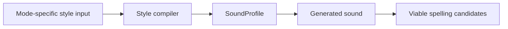

# Name Forge Architecture

Name Forge is a random-name workbench whose first serious mode is **Fiction cast**. The current implementation should be read as a fiction-cast product surface built on reusable generation, scoring, comparison, diagnostics, export, and provenance primitives.

The architecture goal is not to build a generic abstraction before the product earns it. The goal is to keep fiction-specific UX behind a clear mode boundary while the engine remains useful for future naming modes.

Related docs:

- [`product-brief.md`](product-brief.md): product thesis, mode strategy, candidate modes, and recommended sequencing.
- [`current-product-scope.md`](current-product-scope.md): active scope lens, shipped baseline, and next feature requirements.
- [`product-requirements.md`](product-requirements.md): original requirements and historical build-order scaffold.
- [`product-architecture.md`](product-architecture.md): product-level mode strategy.
- [`phase-one-closeout.md`](phase-one-closeout.md): Phase One completion and replacement tracking model.

## Current architecture thesis

Name Forge works by combining controlled randomness with explicit product judgment:

1. Compile ergonomic style input into `SoundProfile`, the single internal sound contract.
2. Generate candidate names from seeded randomness and soft-coded style data while the sound-first core is introduced in slices.
3. Shape candidates through silhouettes, rarity planning, role metadata, and optional role influence.
4. Score candidates with decomposed fit signals, including role fit where applicable.
5. Select an ensemble that avoids obvious sameness.
6. Attach deterministic readability diagnostics without claiming canonical pronunciation.
7. Preserve provenance so generated names, listed alternates, rule-created variants, diagnostics, and future external-source results stay distinguishable.

The important split is:

- **Engine primitives** are shared and reusable.
- **Mode presentation** is user-facing and can be fiction-specific.

## Architectural principles

1. **Controlled stochasticity**: random generation is deterministic by seed and constrained by explicit settings.
2. **Sound before spelling**: style compilers produce a `SoundProfile`; future generator slices should produce generated sound before projecting viable spellings.
3. **Silhouette before spelling**: shape the intended name before exact letters are chosen.
4. **Ensemble-aware selection**: the first serious output is a cast, so repeated initials, endings, cadence, readability friction, and rarity clusters matter.
5. **Mode-aware UX, shared primitives**: Fiction cast can have role mix, slot overrides, cast health, and cast export without making those concepts global product assumptions.
6. **Hard-code mechanisms, not linguistic knowledge**: code owns schemas, algorithms, scoring, normalization, diagnostics, and provenance contracts; packs/providers own language-feel data.
7. **Generated primary names**: style packs guide generation; they are not copied as the primary output path.
8. **Provenance-bearing output**: every result should explain source, seed, style, role/rarity shaping, variant relationship, readability notes, and scoring signals.
9. **Small abstraction first**: introduce seams only as needed. The current mode boundary is a lightweight config, not a full plugin framework.
10. **Pronounceability before pronunciation**: scoring and deterministic readability diagnostics may ship before text pronunciation, IPA, or audio artifacts.

## Runtime pipeline

The sound-first core is being introduced in scoped slices. The implemented compiler boundary is:

```text
StyleInput
  -> compileStyle(input)
  -> SoundProfile
```

Future slices extend that boundary to:

```text
Style input
  -> style compiler
  -> SoundProfile
  -> generated sound
  -> viable spelling candidates
```



The current app runtime still uses the established Fiction cast pipeline until the later sound generation and spelling slices are wired in:

```text
Active mode config
  -> Default GenerationSettings
  -> User settings
  -> Resolve style pack
  -> Resolve role, role influence, and rarity settings
  -> Construct silhouettes
  -> Generate candidate pool
  -> Score candidates, including role signals
  -> Apply ensemble constraints
  -> Attach identity and role metadata
  -> Generate variants
  -> Diagnose readability
  -> Attach provenance
  -> Return ranked ensemble
```

Each step should remain testable as TypeScript. UI code renders controls and results; it should not own generation behavior.

## Style compiler contract

`StyleInput` captures ergonomic user intent for one naming job. It should describe how the name should feel to the user, not phonological implementation details or a generic mode selector. The first compiler input contains only broad style controls: feel, length, and distinctiveness.

`compileStyle(input)` is the boundary that translates those user-facing controls into the internal `SoundProfile`. That means phonotactic weights, cadence preferences, syllable targets, and similar sound-generation details belong in the compiled profile, not in the user input.

`SoundProfile` is the single internal compiled engine contract for later sound generation work. Future compilers for other naming jobs may expose different ergonomic inputs, but they should compile into the same `SoundProfile` contract rather than teaching the generator about job-specific input shapes.

Do not use an ERD or UML class diagram for this layer yet. The useful artifact is the directional flow above: input intent is compiled into a sound contract, the generator consumes sound, and spellings are projections of that sound.

## Module boundaries

```text
src/
  App.tsx                 UI shell, active mode selection, interaction state, and locked-slot state
  App.test.tsx            SSR smoke coverage for shell-level UI contracts
  main.tsx                Vite/React entrypoint
  styles.css              Global presentation
  card-locks.css          Lock-control presentation
  cast-mode.css           Fiction Cast feature styling
  data/
    stylePacks.ts         Built-in soft-coded style packs
  engine/
    diagnostics.ts        Deterministic readability diagnostics and cast summaries
    ensemble.ts           Cast-level selection, diversity penalties, locked-slot preservation, and role attachment
    export.ts             JSON and Markdown cast serialization
    identity.ts           Given/surname/title/epithet identity composition
    generator.ts          Candidate materialization from silhouettes, style packs, and settings
    random.ts             Deterministic seeded randomness
    rarity.ts             Rarity distribution preset planning
    registry.ts           Provider/source lookup and style-pack registry
    roles.ts              Cast role labels, presets, parsing, slot resolution, and role influence profiles
    scoring.ts            Candidate score and explanation signals
    silhouettes.ts        NameSilhouette construction and rarity/shape planning
    soundProfile.ts       SoundProfile contract and private compiled-profile subtypes
    styleCompiler.ts      StyleInput and compileStyle boundary
    types.ts              Existing core domain types and contracts
    variants.ts           Spelling variant generation and provenance
  ui/
    AboutView.tsx         Product explanation copy
    CastHealth.tsx        Deterministic roster-level checks and display
    ChangelogView.tsx     In-app changelog rendering
    GeneratorView.tsx     Mode-aware controls, roster/inspector layout, selection state, and export surface
    modes.ts              Current mode config, defaults, labels, and presentation copy
    NameCard.tsx          Compact selectable/lockable generated-name tile
    NameInspector.tsx     Selected-name detail surface
    namePresentation.ts   Shared name display, length, rarity, and construction-cue helpers
    ScoreControl.tsx      Numeric and slider score control rendering
    presentation.ts       UI labels, score labels, rarity labels, and changelog entries
```

## Mode system

Name Forge should be treated as a mode-based product, not a collection of unrelated generators. A mode defines the naming job being performed. Shared primitives provide the reusable generation, scoring, comparison, diagnostics, export, and provenance machinery beneath that job.

The app currently exposes one mode: **Fiction cast**.

### Current mode config

`src/ui/modes.ts` owns the current mode config:

- mode id and labels
- hero copy
- result and export headings
- generate button copy
- default `GenerationSettings`
- user-facing description for the first `What are you naming?` selector

This boundary keeps fiction-cast defaults and presentation out of `App.tsx` without pretending future modes are fully designed. The next mode should extend this seam only after its workflow is concrete.

### What belongs in a mode

Mode-level code may own:

- product vocabulary
- default settings
- control grouping and labels
- mode-specific result headings
- export headings and export vocabulary
- scoring emphasis and fit explanation copy
- user-facing result-card and inspector presentation choices

### What does not belong in a mode

Mode-level code should not fork core mechanics unnecessarily. The following should remain shared until a real second mode proves otherwise:

- the shared `SoundProfile` contract produced by style compilers
- seeded random generation
- style-pack lookup and provider registry contracts
- deterministic readability diagnostics
- silhouette construction
- candidate generation
- decomposed scoring primitives
- set/list comparison pressure
- spelling variant relationships
- warning and collision metadata
- provenance structure
- JSON/Markdown serialization mechanics where the shape is not mode-specific

### Adding a future mode

A future mode should be added only when it has a clear user job, output contract, and validation target. Do not add placeholder modes just to populate the selector.

Before adding a second active mode, answer:

1. What user job does this mode perform?
2. What controls are required on day one?
3. What result-card shape is useful for scanning output?
4. Which shared primitives does it reuse?
5. Which assumptions from Fiction cast must not leak into it?
6. What fixture or smoke test proves the mode boundary works?

The first second mode should likely be close to Fiction cast, such as Game NPC, because it can stress the mode boundary without requiring a wholly different engine. It should follow variant/source/warning hardening rather than precede it.

## Shared engine primitives

These should remain reusable across future modes:

- `SoundProfile`
- seeded random utility
- style pack and provider registry
- `NameSilhouette`
- candidate generation
- decomposed scoring
- deterministic readability diagnostics
- ensemble/list comparison pressure
- identity composition
- spelling variants and relationship metadata
- warning/collision metadata
- provenance entries
- JSON/Markdown export mechanics

Fiction-specific concepts can use these primitives, but should not silently redefine them globally.

## Core domain model

The engine centers on these first-class types:

- `StyleInput`: ergonomic user-facing style intent for this first compiler. It is not a generic mode selector and should not contain sound-engine internals.
- `SoundProfile`: compiled internal engine contract consumed by later sound generation work.
- `GenerationSettings`: adjustable axes such as cast size, seed, style pack, name format, role preset, role influence, rarity distribution, novelty, pronounceability, memorability, cultural anchoring, and orthographic weirdness.
- `ReadabilityDiagnostic`: non-canonical readability/speakability notes for names and casts.
- `NameSilhouette`: the pre-spelling shape of one full name.
- `GeneratedName`: rendered text plus identity parts, optional role metadata, optional role influence metadata, score metadata, variants, readability diagnostics, provenance, warnings, and seed.
- `NameScores`: decomposed scoring signals, not just one opaque score.
- `CastRoleAssignment`: fiction-cast role metadata resolved from a preset or slot override.
