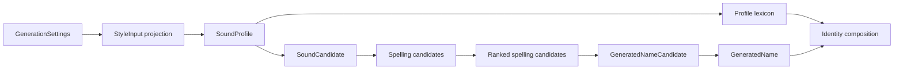

# Name Forge Architecture

Name Forge is a random-name workbench whose first serious mode is **Fiction cast**. The current implementation should be read as a fiction-cast product surface built on reusable generation, scoring, comparison, diagnostics, and export primitives.

The architecture goal is not to build a generic abstraction before the product earns it. The goal is to keep fiction-specific UX behind a clear mode boundary while the engine remains useful for future naming modes.

Related docs:

- [`product-brief.md`](product-brief.md): product thesis, mode strategy, candidate modes, and recommended sequencing.
- [`current-product-scope.md`](current-product-scope.md): active scope lens, shipped baseline, and next feature requirements.
- [`product-requirements.md`](product-requirements.md): original requirements and historical build-order scaffold.
- [`product-architecture.md`](product-architecture.md): product-level mode strategy.
- [`phase-one-closeout.md`](phase-one-closeout.md): Phase One completion and replacement tracking model.

## Current architecture thesis

Name Forge works by combining controlled randomness with explicit product judgment:

1. Compile ergonomic style input into `SoundProfile`, the internal sound grammar for one naming job.
2. Generate a `SoundCandidate` and ranked spelling candidates from seeded randomness and the compiled profile.
3. Select one ranked spelling as the app-facing `GeneratedName` text while retaining the selected sound and spelling metadata.
4. Shape candidates through silhouettes, rarity planning, role metadata, and optional role influence.
5. Score candidates with decomposed fit signals, including role fit where applicable.
6. Select an ensemble that avoids obvious sameness.
7. Attach deterministic readability diagnostics without claiming canonical pronunciation.
8. Preserve explicit source descriptors where source or pack identity is useful, without treating source metadata as a cross-cutting runtime field.

The important split is:

- **Engine primitives** are shared and reusable.
- **Mode presentation** is user-facing and can be fiction-specific.

## Architectural principles

1. **Controlled stochasticity**: random generation is deterministic by seed and constrained by explicit settings.
2. **Sound structure before spelling**: style compilers produce a `SoundProfile`; generator slices produce a pre-spelling segment sequence before projecting viable spellings.
3. **Silhouette before spelling**: shape the intended name before exact letters are chosen.
4. **Ensemble-aware selection**: the first serious output is a cast, so repeated initials, endings, cadence, readability friction, and rarity clusters matter.
5. **Mode-aware UX, shared primitives**: Fiction cast can have role mix, slot overrides, cast health, and cast export without making those concepts global product assumptions.
6. **Hard-code mechanisms, not linguistic knowledge**: code owns schemas, algorithms, scoring, normalization, diagnostics, and source descriptor contracts; packs/providers own language-feel data.
7. **Generated primary names**: style packs guide generation; they are not copied as the primary output path.
8. **Sound-bearing output**: everything verbal that appears in the resultant name should be licensed by the compiled sound grammar. Prefixes, suffixes, honorifics, titles, epithets, and place-like components are not arbitrary downstream text decorations.
9. **Serializable IR contracts**: `SoundProfile` and downstream candidate types should stay data-shaped and should not store callbacks, caches, UI state, or runtime handles.
10. **Small abstraction first**: introduce seams only as needed. The current mode boundary is a lightweight config, not a full plugin framework.
11. **Pronounceability before pronunciation**: scoring and deterministic readability diagnostics may ship before text pronunciation, IPA, or audio artifacts.

## Runtime pipeline

The current app runtime now routes primary name materialization through the sound-first result shape:

```text
GenerationSettings
  -> StyleInput projection
  -> compileStyle(input)
  -> SoundProfile
  -> generateSound(profile, rng)
  -> SoundCandidate
  -> generateSpellings(sound)
  -> SpellingCandidate[]
  -> rankSpellings(spellings, profile)
  -> RankedSpellingCandidate[]
  -> GeneratedNameCandidate
  -> GeneratedName selected from rank #1
  -> identity composition from generated/profile-licensed parts
  -> UI/export
```

`GeneratedNameCandidate` is the pre-selection result that owns the full ranked spelling pool. `GeneratedName` is the app-facing selected result: it carries the compiled `soundProfile`, generated `sound`, and selected `spelling`, but not the entire ranked spelling pool.



The sequence layer is deliberately not called a single generated sound. `SegmentSequence` represents one pre-spelling candidate form with syllable segmentation metadata, then projects to one or more spellings.

The active Fiction cast path remains cast-oriented:

```text
Active mode config
  -> Default GenerationSettings
  -> User settings
  -> Resolve style pack
  -> Resolve role, role influence, and rarity settings
  -> Construct silhouettes
  -> Generate sound-first candidate pool
  -> Score candidates, including role signals
  -> Apply ensemble constraints
  -> Attach identity and role metadata from generated/profile-licensed material
  -> Generate variants from selected spelling
  -> Diagnose readability
  -> Return ranked ensemble
```

Each step should remain testable as TypeScript. UI code renders controls and results; it should not own generation behavior.

## Style compiler contract

`StyleInput` captures ergonomic user intent for one naming job. It should describe how the name should feel to the user, not phonological implementation details or a generic mode selector. The first compiler input contains only broad style controls: feel, length, and distinctiveness.

`compileStyle(input)` is the boundary that translates those user-facing controls into the internal `SoundProfile`. That means phonotactic weights, cadence preferences, syllable targets, profile-licensed title/epithet lexemes, and similar name-construction details belong in the compiled profile, not in the user input.

`SoundProfile` is the single internal compiled engine contract for later segment-sequence generation work. The type should be understood as a compiled sound grammar for the naming job rather than one generated sound or one final name. Future compilers for other naming jobs may expose different ergonomic inputs, but they should compile into the same `SoundProfile` contract rather than teaching the generator about job-specific input shapes.

`SoundProfile` is not merely a bag of phoneme weights. If a format requires a prefix, suffix, honorific, title, epithet, or place-like component, that component must be represented as generated sound, profile data, or a profile-selected lexeme. The identity layer may arrange already licensed parts, but it must not invent new sound material by string surgery.

Do not use an ERD or UML class diagram for this layer yet. The useful artifact is the directional flow above: input intent is compiled into a sound-structure contract, the generator produces pre-spelling segment sequences, and spelling candidates are projections of those sequences.

## Starter sound segment inventory

The first hard-coded engine-local sound inventory is split by concern:

- `src/engine/soundSegmentTypes.ts` owns the segment type model.
- `src/engine/starterSoundInventory.ts` owns the built-in starter inventory table and lookup.

The starter inventory is a built-in table of stable sound segment ids, display symbols, durable feature metadata, and syllable-role metadata. It is not a generic source system, user-import format, language pack, or pronunciation database.

The term segment is intentional. It is broader than phoneme and avoids claiming a language-specific contrastive unit. The current inventory is broad enough to cover common English-oriented consonants, monophthong nuclei, and diphthong nuclei for upcoming generator work, but the symbols remain display transcription symbols for generated fixtures rather than verified pronunciation for any language, dialect, speaker, TTS provider, or external source.

Segment metadata deliberately separates broad category from feature axes. Consonants carry manner, place, voicing, and sonority. Vowels carry monophthong or diphthong movement, vowel target metadata, and sonority. This keeps liquid, glide, nasal, obstruent, and vowel behavior available for generation without using those classes as the top-level segment category.

## Deterministic sound generation

`src/engine/soundGenerator.ts` owns the internal generator that consumes `SoundProfile` and `SeededRandom`. It returns `SoundCandidate`, whose durable payload is a flat `SegmentSequence` plus syllable spans for onset, nucleus, coda, shape, and display transcription rendering.

This generator is deterministic by seed and profile. The generated transcription is a display/debug rendering of internal segments, not a user-facing pronunciation authority.

## Audition rendering

Audition rendering is a two-stage pipeline over generated sound sequences:

```text
SegmentSequence
  -> AuditionPhonology
  -> renderer-specific projection
```

`src/engine/auditionPhonology.ts` owns the renderer-neutral audition structure derived from `SegmentSequence`. It preserves syllable order, segment slices, onset/nucleus/coda role segments, and deterministic stress hints without depending on `GeneratedName`, selected spelling text, React, browser APIs, or any paid TTS provider.

`src/engine/browserAuditionProjection.ts` owns the browser-specific projection from `AuditionPhonology` to a speakable `BrowserAuditionCue`. This cue is a practical browser voice draft and is not an IPA transcription, SSML payload, provider payload, or canonical pronunciation.

`src/engine/audition.ts` is a thin composition/export boundary for the current UI. It should not absorb renderer-specific logic as additional renderers are added.

Phrase-level audition for identities with generated parts, profile lexemes, and literals is a future layer over the same adapter boundary; it should preserve per-part provenance instead of flattening a formatted identity to raw text.

## Spelling generation and ranking

`src/engine/spellingGenerator.ts` owns the projection from `SoundCandidate` to spelling candidates. The boundary is intentionally split:

- `generateSpellings(sound)` projects one sound candidate into every viable spelling candidate known to the starter grapheme rules.
- `rankSpellings(spellings, profile)` orders already-generated spelling candidates using deterministic ranker logic composed from `SoundProfile` fields.
- `generateRankedSpellings(sound, profile)` is a convenience composition of the two operations.

The profile does not store JavaScript callbacks. It remains a serializable data contract. Ranking callbacks and weights are internal engine mechanics derived from profile data and engine-local spelling rules.

Spelling candidates carry text plus segment-to-text mapping data for Inspect/export explanation surfaces. Ranked spelling candidates add rank and score. This layer does not use external spelling databases, TTS, source taxonomy, or canonical pronunciation claims.

## Name construction and sound identity

Everything verbal in the resultant name has sound. A generated sound may produce multiple spellings, but adding or removing sound-bearing material creates a different name candidate, not a formatting variant.

The identity layer may compose already generated or profile-licensed parts into display forms such as `{given}`, `{given} {family}`, `{title} {given}`, or `{given} {epithet} of {place}`. It must not append suffixes, prefixes, honorifics, epithets, or place markers as arbitrary post-generation string edits.

Current identity construction obeys that boundary by using generated names for given/family/place parts, initials derived from generated names, and title/epithet lexemes selected from the compiled `SoundProfile.lexicon`. Place-style identities use the generated supporting name as the place component directly. Place suffixes such as `vale`, `ford`, or `mere` can be supported only as generated sound, profile lexemes, or construction slots selected by the compiled profile before spelling, not after a name has already been generated.

## Future sequence boundaries

`SegmentSequence` represents one pre-spelling candidate form, not one final name. Its source of truth is a flat ordered segment list, with syllable segmentation recorded as spans over that list. That avoids storing both a flat segment array and nested syllable arrays as competing authoritative representations.

Syllable metadata should still matter. The sequence model should be able to represent onset, nucleus, coda, stress, cadence, and pronounceability features, because those are useful for ensemble diversity and spelling projection.

The ensemble path should be pool-based: one `SoundProfile` can produce many `SegmentSequence` candidates, spelling projection can produce many spelling candidates, and the ensemble selector can score both sequence-level diversity and spelling-level readability before choosing the final cast.

TTS and pronunciation rendering should remain adapters, not core generation behavior. A sequence can later be rendered to debug text, display transcription, SSML phoneme markup, plain TTS text, or provider-specific payloads, but those projections should not make the internal sequence model depend on one TTS provider, SSML alphabet, or canonical pronunciation claim.

## Module boundaries

```text
src/
  App.tsx                 UI shell, active mode selection, interaction state, and locked-slot state
  App.test.tsx            SSR smoke coverage for shell-level UI contracts
  main.tsx                Vite/React entrypoint
  styles.css              Global presentation
  card-locks.css          Lock-control presentation
  cast-mode.css           Fiction Cast feature styling
  data/
    stylePacks.ts         Built-in soft-coded style packs
  engine/
    audition.ts           Thin audition composition/export boundary
    auditionPhonology.ts  SegmentSequence to renderer-neutral audition phonology
    browserAuditionProjection.ts  Browser voice draft projection from audition phonology
    diagnostics.ts        Deterministic readability diagnostics and cast summaries
    ensemble.ts           Cast-level selection, diversity penalties, locked-slot preservation, and role attachment
    export.ts             JSON and Markdown cast serialization
    identity.ts           Identity composition from generated names and profile-licensed lexemes
    generator.ts          Sound-first candidate materialization from silhouettes, settings, and compiled profiles
    random.ts             Deterministic seeded randomness
    rarity.ts             Rarity distribution preset planning
    registry.ts           Provider/source lookup and style-pack registry
    roles.ts              Cast role labels, presets, parsing, slot resolution, and role influence profiles
    scoring.ts            Candidate score and explanation signals
    silhouettes.ts        NameSilhouette construction and rarity/shape planning
    soundGenerator.ts     Deterministic SoundProfile to SoundCandidate and SegmentSequence generation
    soundProfile.ts       SoundProfile contract and private compiled-profile subtypes
    soundSegmentTypes.ts  Sound segment type model
    spellingGenerator.ts  Spelling projection and profile-aware spelling ranking
    starterSoundInventory.ts  Starter sound segment inventory and lookup
    styleCompiler.ts      StyleInput and compileStyle boundary
```
