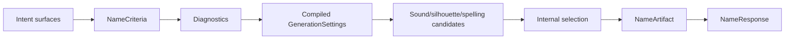

# Name Forge Architecture

Name Forge is a random-name workbench whose durable product artifact is an inspectable `NameArtifact`. Its first serious surface is **Fiction cast**, but the engine direction is criteria-driven rather than cast-driven.

The architecture goal is not to build a generic abstraction before the product earns it. The goal is to keep fiction-specific UX behind a clear product/mode boundary while shared engine primitives move through a stable `NameRequest -> NameResponse` contract.

Related docs:

- [`model-module-contracts.md`](model-module-contracts.md): model inventory, module input/output contracts, and collection-order semantics.
- [`sound-model-behavior.md`](sound-model-behavior.md): lay explanation of sound behavior, data ownership, ordering, syllables, stress, and projection boundaries.
- [`product-brief.md`](product-brief.md): product thesis, mode strategy, candidate modes, and recommended sequencing.
- [`current-product-scope.md`](current-product-scope.md): active scope lens, shipped baseline, and next feature requirements.
- [`product-requirements.md`](product-requirements.md): original requirements and historical build-order scaffold.
- [`product-architecture.md`](product-architecture.md): product-level mode strategy and criteria UI direction.
- [`phase-one-closeout.md`](phase-one-closeout.md): Phase One completion and replacement tracking model.
- [`requirements/name-request-v1-checkpoint.md`](requirements/name-request-v1-checkpoint.md): checkpoint after Slices 1-8 and boundary before Slice 9.
- [`requirements/name-grouping-design-boundary.md`](requirements/name-grouping-design-boundary.md): Slice 9 docs-only boundary for future grouping, quantity, and set criteria design.
- [`decisions/0001-name-artifact-and-request-contract.md`](decisions/0001-name-artifact-and-request-contract.md): `NameArtifact` and `NameRequest -> NameResponse` direction.
- [`decisions/0002-criteria-driven-generation.md`](decisions/0002-criteria-driven-generation.md): criteria-driven generation and internal scoring.
- [`decisions/0003-intent-criteria-compiler-pipeline.md`](decisions/0003-intent-criteria-compiler-pipeline.md): intent surfaces to criteria to compiler pipeline.
- [`decisions/0004-modes-presets-and-grouping.md`](decisions/0004-modes-presets-and-grouping.md): modes, presets, skins, and grouping boundaries.

## Current architecture thesis

Name Forge works by combining controlled randomness with explicit product judgment:

1. User-facing intent surfaces declare `NameCriteria`.
2. Criteria compile into current generator settings, spelling preferences, exclusions, practical constraints, and selection inputs.
3. The sound-first generator produces `SoundCandidate` values and ranked spelling candidates from seeded randomness and compiled profile data.
4. Internal candidate scoring and spelling selection choose the app-facing artifact while retaining sound, spelling, scoring, and diagnostic metadata.
5. Fiction cast currently adds silhouettes, role metadata, role influence, and ensemble selection around those shared primitives. Those Cast concepts remain active app-surface behavior, not global engine assumptions.
6. Deterministic readability and audition projections explain selected names without claiming canonical pronunciation.

The important split is:

- **Engine primitives** are shared and reusable.
- **Mode presentation** is user-facing and can be fiction-specific.
- **Criteria** are the stable bridge between product controls and engine behavior.

## Architectural principles

1. **Controlled stochasticity**: random generation is deterministic by seed and constrained by explicit criteria/settings.
2. **Criteria before generation**: user-facing controls, presets, and future assistive parsing should produce criteria before they affect generation.
3. **Sound structure before spelling**: compilers produce a `SoundProfile`; generator slices produce a pre-spelling segment sequence before projecting viable spellings.
4. **Silhouette before spelling**: shape the intended name before exact letters are chosen.
5. **Scoring as selection machinery**: internal candidate scoring is functional when it affects which name is selected. Public criteria-match UI can come later.
6. **Grouping later, Cast not core**: Fiction cast can have role mix, slot overrides, cast health, and cast export without making those concepts global engine assumptions. Future ensemble behavior should move toward grouping/set semantics.
7. **Mode-aware UX, criteria-driven engine**: modes may prefill criteria, choose skins, and shape presentation, but v1 generation should not branch on `mode`.
8. **Hard-code mechanisms, not linguistic knowledge**: code owns schemas, algorithms, scoring, normalization, diagnostics, and source descriptor contracts; packs/providers own language-feel data.
9. **Generated primary names**: style packs and presets can guide criteria or generation; they are not copied as the primary output path.
10. **Sound-bearing output**: everything verbal that appears in the resultant name should be licensed by the compiled sound grammar. Prefixes, suffixes, honorifics, titles, epithets, and place-like components are not arbitrary downstream text decorations.
11. **Serializable IR contracts**: `NameCriteria`, `SoundProfile`, and downstream candidate types should stay data-shaped and should not store callbacks, caches, UI state, or runtime handles.
12. **Small abstraction first**: introduce seams only as needed. The current mode boundary is a lightweight config, not a full plugin framework.
13. **Pronounceability before pronunciation**: scoring, deterministic readability diagnostics, and browser audition drafts may ship before IPA, dictionaries, or provider-specific audio.

## Planning pipeline

The durable planning pipeline is:

```text
Intent surfaces
  -> NameCriteria
  -> compiled criteria
  -> SoundProfile / spelling preferences / exclusions / selection inputs
  -> candidate generation and scoring
  -> NameArtifact
```

`StyleInput -> compileStyle -> SoundProfile` remains the current implementation bridge for style-pack generation, not the final user-intent abstraction. A chip library, selected-criteria shelf, preset, saved preference, or later LLM-assisted parser should all be able to produce the same criteria contract without teaching the generator a new input shape.

## Runtime pipeline

The current v1 request runtime wraps the existing generator rather than replacing it wholesale:

```text
NameRequest
  -> resolve seed / criteria / optional mode metadata
  -> diagnostics
  -> compile NameCriteria into current GenerationSettings
  -> generate sound/silhouette/spelling candidates
  -> internally select spelling candidate when compiled criteria request selection pressure
  -> map GeneratedName to NameArtifact
  -> NameResponse containing exactly one artifact
```

That path is singular by design. V1 returns exactly one name artifact in `NameResponse.names`. Runtime quantity, grouping, slotted generation, and set selection remain future extensions.

Slice 9 documents the future grouping boundary without changing that runtime. `NameQuantity`, `NameGrouping`, and `NameSetCriteria` remain design vocabulary only until a later contract slice accepts a grouped request/response shape. Do not add grouping fields to the current public v1 `NameRequest`, do not make `mode` drive grouping behavior, and do not treat Fiction Cast role/ensemble concepts as global engine assumptions.

The older settings-facing Fiction cast runtime still powers the active app surface:

```text
Fiction Cast UI controls
  -> GenerationSettings
  -> StyleInput projection
  -> compileStyle(input)
  -> SoundProfile
  -> generate sound-first candidate pool
  -> rank spelling candidates
  -> internally select display spelling
  -> identity composition from generated/profile-licensed parts
  -> UI/export
```

`GeneratedNameCandidate` is the pre-selection result that owns the ranked spelling list. `GeneratedName` is the current app-facing selected result: it carries the compiled `soundProfile`, generated `sound`, selected `spelling`, and retained ranked spelling alternatives. `NameArtifact` is the request/response artifact mapped from that selected result. Internal spelling or candidate scores are selection machinery; they must not be presented as public fit percentages or a Criteria Match UI.


```mermaid
flowchart LR
  A[Intent surfaces] --> B[NameCriteria]
  B --> C[Diagnostics]
  C --> D[Compiled GenerationSettings]
  D --> E[Sound/silhouette/spelling candidates]
  E --> F[Internal selection]
  F --> G[NameArtifact]
  G --> H[NameResponse]
```

The sequence layer is deliberately not called a single generated sound. `SegmentSequence` represents one pre-spelling candidate form with syllable segmentation metadata, then projects to one or more spellings.

The active Fiction cast path remains cast-oriented at the product surface:

```text
Active mode config
  -> Default GenerationSettings
  -> User settings
  -> Resolve style pack
  -> Resolve role, role influence, and rarity settings
  -> Construct silhouettes
  -> Generate sound-first candidate pool
  -> Score candidates, including role signals
  -> Apply ensemble constraints
  -> Attach identity and role metadata from generated/profile-licensed material
  -> Generate variants from selected spelling
  -> Diagnose readability
  -> Return ranked ensemble
```

That active surface is allowed to speak in Cast terms. Shared request/response docs should not treat Cast role mix, slot overrides, cast health, or ensemble export as global engine assumptions.

Each step should remain testable as TypeScript. UI code renders controls and results; it should not own generation behavior.

## Criteria and compiler contract

`NameCriteria` is the durable input model for declared naming criteria. It can be produced by UI controls, presets, selected chips, drawer choices, saved preferences, or future assistive parsing.

`StyleInput` captures the current narrow ergonomic style projection. It should be treated as one implementation bridge into `SoundProfile`, not as the universal representation of all user intent.

`compileStyle(input)` currently translates broad style controls into the internal `SoundProfile`. `compileNameCriteriaToGenerationSettings(criteria, base)` currently translates a small supported subset of `NameCriteria` into current `GenerationSettings` so the v1 request adapter can reuse the existing generator. Future criteria compilation can translate more criteria into the same lower-level concerns: phonotactic weights, cadence preferences, syllable targets, spelling preferences, exclusion pressure, candidate scoring inputs, profile-licensed title/epithet lexemes, and similar name-construction details.

`diagnosticsForNameCriteria(criteria)` reports unsupported or partially implemented criteria honestly while preserving the singular v1 fallback path. Diagnostics are not public fit scores.

Follow-up risk: supported-criteria knowledge is currently duplicated between `nameCriteriaCompiler.ts` and `nameCriteriaDiagnostics.ts`. Before expanding supported criteria targets, centralize supported-target metadata or introduce a shared helper such as `isCriteriaClauseCompiled(...)` so diagnostics and compilation cannot drift.

`SoundProfile` is the internal compiled sound contract for segment-sequence generation work. The type should be understood as a compiled sound grammar rather than one generated sound or one final name.

`SoundProfile` is not merely a bag of phoneme weights. If a format requires a prefix, suffix, honorific, title, epithet, or place-like component, that component must be represented as generated sound, profile data, or a profile-selected lexeme. The identity layer may arrange already licensed parts, but it must not invent new sound material by string surgery.

Do not use an ERD or UML class diagram for this layer yet. The useful artifact is the directional flow above: declared criteria compile into a sound-structure contract, the generator produces pre-spelling segment sequences, and spelling candidates are projections of those sequences.

## Starter sound segment inventory

The first hard-coded engine-local sound inventory is split by concern:

- `src/engine/soundSegmentTypes.ts` owns the segment type model.
- `src/engine/starterSoundInventory.ts` owns the built-in starter inventory table and lookup.

The starter inventory is a built-in table of stable sound segment ids, display symbols, durable feature metadata, and syllable-role metadata. It is not a generic source system, user-import format, language pack, or pronunciation database.

The term segment is intentional. It is broader than phoneme and avoids claiming a language-specific contrastive unit. The current inventory is broad enough to cover common English-oriented consonants, monophthong nuclei, and diphthong nuclei for upcoming generator work, but the symbols remain display transcription symbols for generated fixtures rather than verified pronunciation for any language, dialect, speaker, TTS provider, or external source.

Segment metadata deliberately separates broad category from feature axes. Consonants carry manner, place, voicing, and sonority. Vowels carry monophthong or diphthong movement, vowel target metadata, and sonority. This keeps liquid, glide, nasal, obstruent, and vowel behavior available for generation without using those classes as the top-level segment category.

## Deterministic sound generation

`src/engine/soundGenerator.ts` owns the internal generator that consumes `SoundProfile` and `SeededRandom`. It returns `SoundCandidate`, whose durable payload is a flat `SegmentSequence` plus syllable spans for onset, nucleus, coda, shape, and display transcription rendering.

This generator is deterministic by seed and profile. The generated transcription is a display/debug rendering of internal segments, not a user-facing pronunciation authority.

## Audition rendering

Audition rendering is a two-stage pipeline over generated sound sequences:

```text
SegmentSequence
  -> AuditionPhonology
  -> renderer-specific projection
```

`src/engine/auditionPhonology.ts` owns the renderer-neutral audition structure derived from `SegmentSequence`. It preserves syllable order, segment slices, onset/nucleus/coda role segments, and deterministic stress hints without depending on `GeneratedName`, selected spelling text, React, browser APIs, or any paid TTS provider.

`src/engine/browserAuditionProjection.ts` owns the browser-specific projection from `AuditionPhonology` to a speakable `BrowserAuditionCue`. This cue is a practical browser voice draft and is not an IPA transcription, SSML payload, provider payload, or canonical pronunciation.

`src/engine/audition.ts` is a thin composition/export boundary for the current UI. It should not absorb renderer-specific logic as additional renderers are added.

Phrase-level audition for identities with generated parts, profile lexemes, and literals is a future layer over the same adapter boundary; it should preserve per-part provenance instead of flattening a formatted identity to raw text.

## Spelling generation and ranking

`src/engine/spellingGenerator.ts` owns the projection from `SoundCandidate` to spelling candidates and the ranking of those candidates. The boundary is intentionally split:

- `generateSpellingCandidatePool(sound)` projects one sound candidate into every viable spelling candidate known to the starter grapheme rules.
- `rankSpellingCandidatePool(pool, profile)` orders already-generated spelling candidates using deterministic ranker logic composed from `SoundProfile` fields.
- `generateRankedSpellingCandidates(sound, profile)` is a convenience composition of the two operations.

The profile does not store JavaScript callbacks. It remains a serializable data contract. Ranking callbacks and weights are internal engine mechanics derived from profile data and engine-local spelling rules.

Spelling candidates carry text plus segment-to-text mapping data for Inspect/export explanation surfaces. Ranked spelling candidates add rank and score. This layer does not use external spelling databases, TTS, source taxonomy, or canonical pronunciation claims.

## Name construction and sound identity

Everything verbal in the resultant name has sound. A generated sound may produce multiple spellings, but adding or removing sound-bearing material creates a different name candidate, not a formatting variant.

The identity layer may compose already generated or profile-licensed parts into display forms such as `{given}`, `{given} {family}`, `{title} {given}`, or `{given} {epithet} of {place}`. It must not append suffixes, prefixes, honorifics, epithets, or place markers as arbitrary post-generation string edits.

Current identity construction obeys that boundary by using generated names for given/family/place parts, initials derived from generated names, and title/epithet lexemes selected from the compiled `SoundProfile.lexicon`. Place-style identities use the generated supporting name as the place component directly. Place suffixes such as `vale`, `ford`, or `mere` can be supported only as generated sound, profile lexemes, or construction slots selected by the compiled profile before spelling, not after a name has already been generated.

## Future sequence boundaries

`SegmentSequence` represents one pre-spelling candidate form, not one final name. Its source of truth is a flat ordered segment list, with syllable segmentation recorded as spans over that list. That avoids storing both a flat segment array and nested syllable arrays as competing authoritative representations.

Syllable metadata should still matter. The sequence model should be able to represent onset, nucleus, coda, stress, cadence, and pronounceability features, because those are useful for ensemble diversity and spelling projection.

The future grouping path should be pool-based: one compiled profile can produce many `SegmentSequence` candidates, spelling projection can produce many spelling candidates, and the set/ensemble selector can score both sequence-level diversity and spelling-level readability before choosing the final group.

TTS and pronunciation rendering should remain adapters, not core generation behavior. A sequence can later be rendered to debug text, display transcription, SSML phoneme markup, plain TTS text, or provider-specific payloads, but those projections should not make the internal sequence model depend on one TTS provider, SSML alphabet, or canonical pronunciation claim.

## Module boundaries

```text
src/
  App.tsx                 UI shell, active mode selection, interaction state, and locked-slot state
  App.test.tsx            SSR smoke coverage for shell-level UI contracts
  main.tsx                Vite/React entrypoint
  styles.css              Global presentation
  card-locks.css          Lock-control presentation
  cast-mode.css           Fiction Cast feature styling
  data/
    stylePacks.ts         Built-in soft-coded style packs and current preset-like data
  engine/
    audition.ts           Thin audition composition/export boundary
    auditionPhonology.ts  SegmentSequence to renderer-neutral audition phonology
    browserAuditionProjection.ts  Browser voice draft projection from audition phonology
    diagnostics.ts        Deterministic readability diagnostics and cast summaries
    ensemble.ts           Current Cast-level selection, diversity penalties, locked-slot preservation, and role attachment
    export.ts             JSON and Markdown cast serialization
    identity.ts           Identity composition from generated names and profile-licensed lexemes
    generator.ts          Sound-first candidate materialization from silhouettes, settings, and compiled profiles
    nameArtifact.ts       NameArtifact mapping from selected GeneratedName results
    nameCriteria.ts       Stable NameCriteria and clause contract
    nameCriteriaCompiler.ts  Small criteria-to-current-generator compiler
    nameCriteriaDiagnostics.ts  Criteria support diagnostics and fallback reporting
    nameRequest.ts        NameRequest, resolution, randomization, diagnostics, and NameResponse contracts
    random.ts             Deterministic seeded randomness
    rarity.ts             Rarity distribution preset planning
    registry.ts           Provider/source lookup and style-pack registry
    roles.ts              Current Cast role labels, presets, parsing, slot resolution, and role influence profiles
    scoring.ts            Candidate score and explanation signals
    silhouettes.ts        NameSilhouette construction and rarity/shape planning
    soundGenerator.ts     Deterministic SoundProfile to SoundCandidate and SegmentSequence generation
    soundProfile.ts       SoundProfile contract and private compiled-profile subtypes
    soundSegmentTypes.ts  Sound segment type model
    spellingGenerator.ts  Spelling projection and profile-aware spelling ranking
    starterSoundInventory.ts  Starter sound segment inventory and lookup
    styleCompiler.ts      Current StyleInput and compileStyle bridge
```
